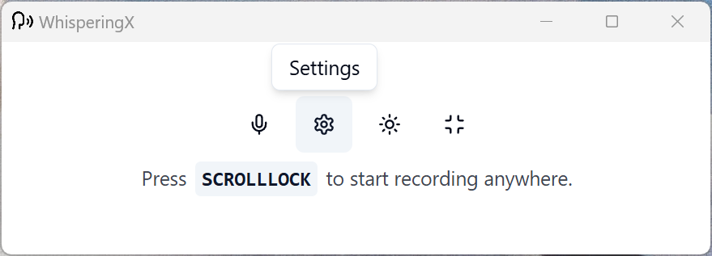
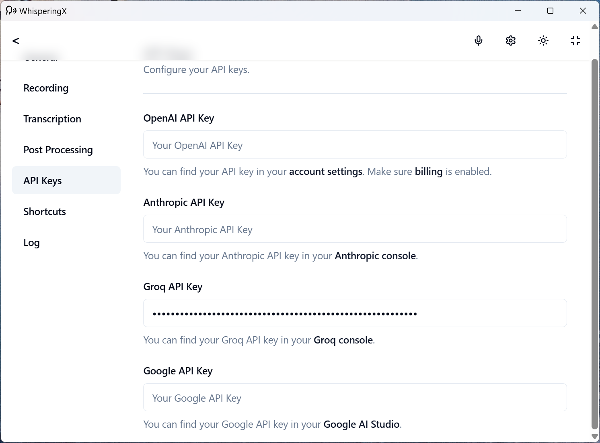
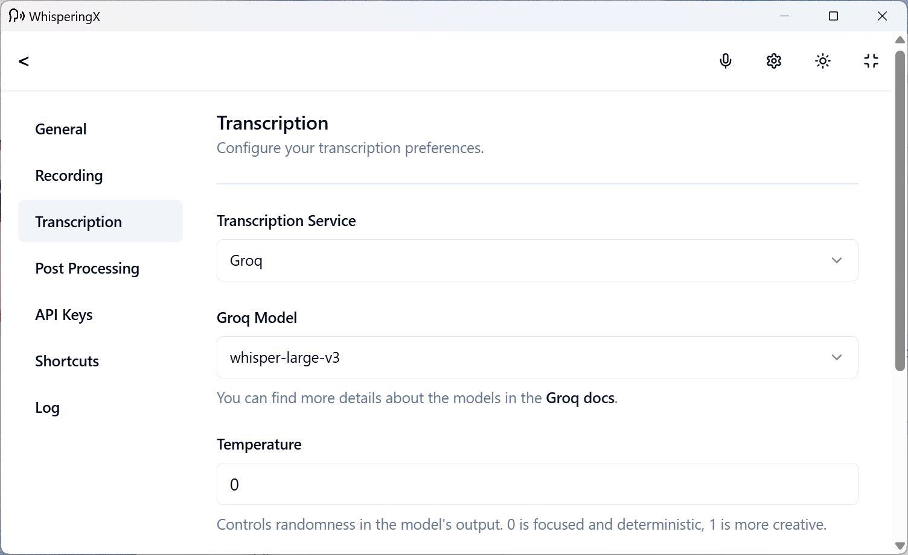
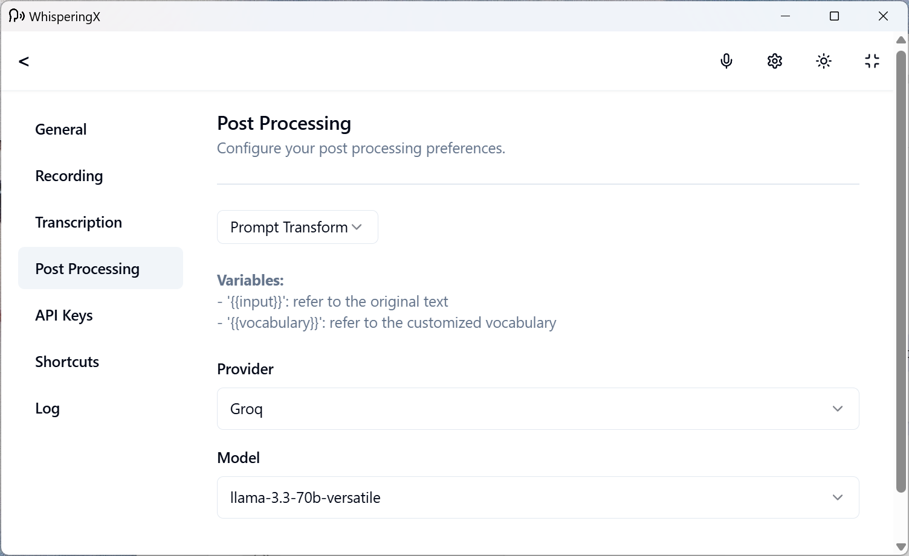
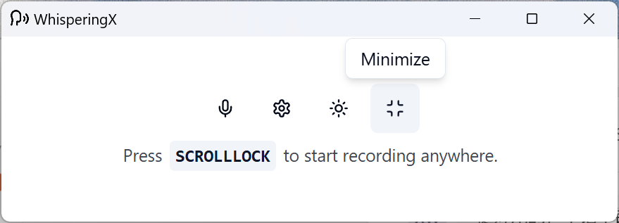

  
  <h1 align="center">WhisperingX</h1>
  
A fork from <a href="https://whispering.bradenwong.com">whispering</a>

## About

WhisperingX is a minimalist transcription tool forked from the open-source project <a href="https://whispering.bradenwong.com">Whispering</a>. Built with a focus on accuracy and simplicity, WhisperingX strips away unnecessary features and code from its predecessor, offering a streamlined experience for users who need reliable audio-to-text conversion.

# Quick Start
1. Go to Settings.

2. Set API keys.

3. Set transcription model

4. Set post processing model (LLM model)

5. Set global shortcut

6. Minimize it to the tray

7. Press and hold the shortcut key, and try it out!

## Build Executables with private key
- Open a new powershell in projects root
- type the following command: `$env:TAURI_SIGNING_PRIVATE_KEY="Your private key"` (env variables do not persist across terminals)
- type: `$env:TAURI_SIGNING_PRIVATE_KEY` It should return your private key.
- in the same powershell type: `npm run tauri build`.