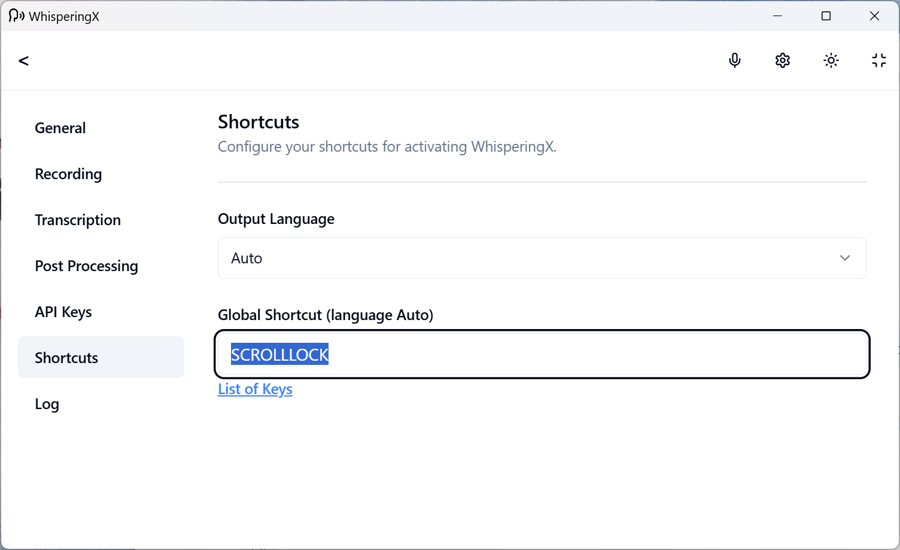
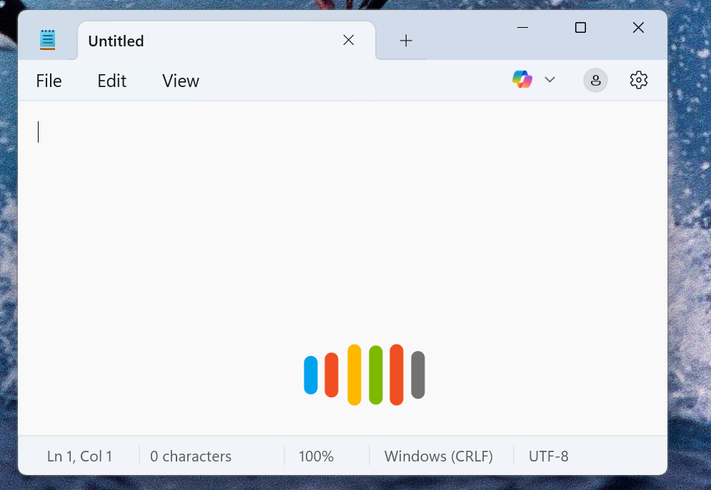

<p align="center">
  <a>
    
    </a>
  <h1 align="center">WhisperingX</h1>
</p>

## About

WhisperingX is a minimalist transcription tool forked from the open-source project <a href="https://whispering.bradenwong.com">Whispering</a>. Built with a focus on accuracy and simplicity, WhisperingX strips away unnecessary features and code from its predecessor, offering a streamlined experience for users who need reliable audio-to-text conversion.

# Quick Start
1. Go to Settings.


2. Set API keys.


3. Set transcription model


4. Set post processing model (LLM model)


5. Set global shortcut



6. Minimize it to the tray


7. Press and hold the shortcut key, and try it out!



---
# Tuning for better accuracy.
1. Define your vacabulary, the transcription will favor the words in the vocabulary for better accurracy. Here is an example:
```
'xAI' - company name, 'Grok' - AI assistant name, 'neuralink' - brain-interface tech, 'Yao' - person name
```

2. Override the default prompt passed to Whisper model, by going to Setting->Transcription, expand "Advanced Options". 
You can use `{{vocabulary}}` parameter to reference the vocabulary setting.


3. Override the default system/user prompt passed to LLM for post processing - by going to Settings->Post Processing, expand "Advanced Options". 
You can use `{{vocabulary}}` parameter to reference the vocabulary setting, and the `{{input}}` parameter to reference the transcribed text.


4. Whisper model has language detection, and by default the app put the output language as 'auto', however you can change the output languge in Settings->Shortcut


## Build Executables with private key
- Open a new powershell in projects root
- type the following command: `$env:TAURI_SIGNING_PRIVATE_KEY="Your private key"` (env variables do not persist across terminals)
- type: `$env:TAURI_SIGNING_PRIVATE_KEY` It should return your private key.
- in the same powershell type: `npm run tauri build`.